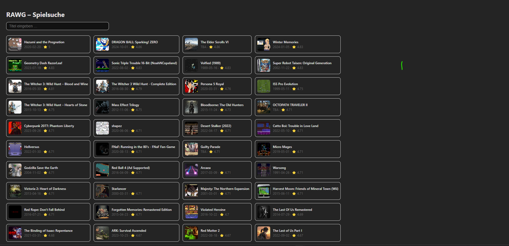
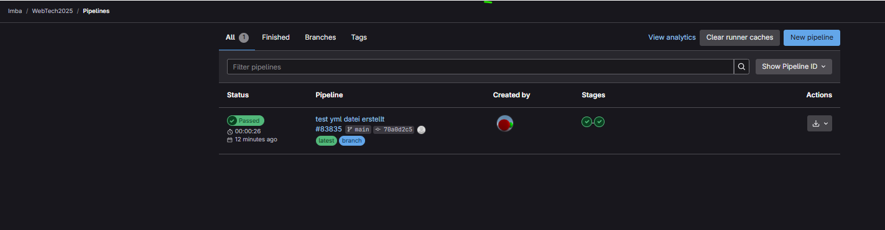
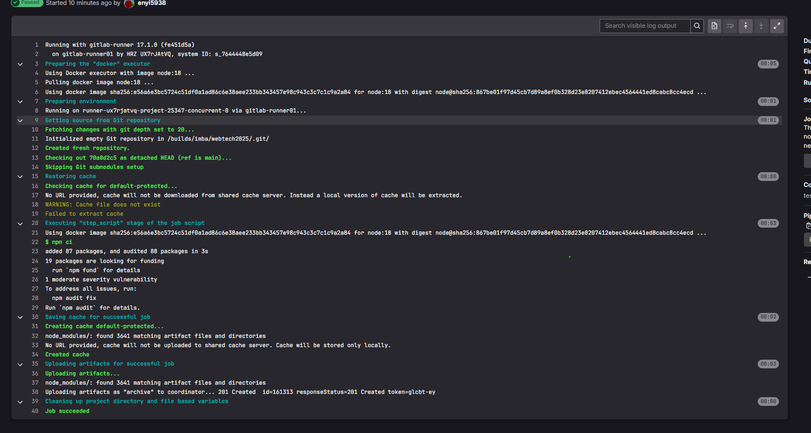
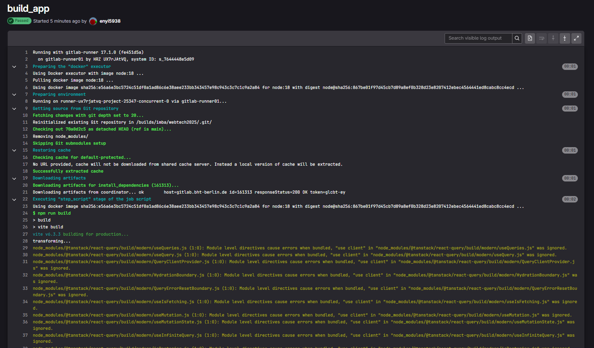
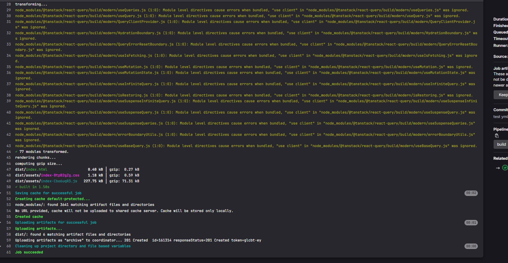

# RAWG Game Search App

Kleine Demo-App mit Vite + React (oder Vue/Angular), die die RAWG-API verwendet, um Spiele zu suchen und anzuzeigen.

## Features

- Suche nach Spieltiteln
- Anzeige von Cover, Release-Datum und Rating
- Pagination: „Mehr laden“-Button
- Typensicherheit mit TypeScript

## Demo



> Hinweis: Screenshot liegt im Projekt unter `/public/screenshot.png`.

---

## Installation

1. **Repository klonen**  
   ```bash
   git clone https://gitlab.bht-berlin.de/imba/webtech2025.git
   cd webtech2025

## License

Dieses Projekt steht unter der MIT-Lizenz – siehe [LICENSE](LICENSE).

## Build (CI/CD)

### 1. Pipeline-Übersicht
Der grüne „Passed“-Status zeigt, dass unsere `.gitlab-ci.yml` erkannt wurde und beide Stages erfolgreich durchliefen.



---

### 2. Install-Job
Hier wird `npm ci` ausgeführt und das `node_modules/`-Verzeichnis als Artifact gespeichert.



---

### 3. Build-Job (Teil 1)
Der Beginn des Build-Jobs: `npm run build` und Vite startet den Produktions-Build.



---

### 4. Build-Job (Teil 2)
Abschluss des Build-Jobs: Artefakte (`dist/`) werden hochgeladen und der Job endet mit „Job succeeded“.



---

## Deployment auf Vercel

Live-Demo: https://webtech2025.vercel.app/